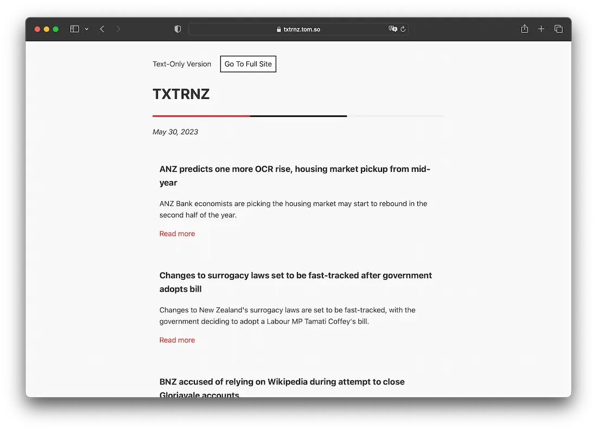

# TXTRNZ - a text-only RNZ news service

TXTRNZ is a lightweight, text-only version of the RNZ (Radio New Zealand) news site, designed to deliver news in the most minimal, bloat-free way possible. The primary goal is to provide a platform for users with low data/bandwidth to access the news with speed and ease.

## Motivation

The initial idea for this project came from RNZ's initiative during the devastating floods in New Zealand. During this crisis, many users were without reliable internet connections, and RNZ maintained a lightweight page of updated information to keep the public informed. This project is inspired by that initiative, as well as [the text-only version of NPR](https://text.npr.org).

## Features

- No images, JavaScript, tracking or unnecessary CSS to deliver news as quickly as possible.
- All scraping and building done server-side to ensure speed.

## Technical Stack

- **Back End**: The "back end" of the application is handled as a single GitHub Action.
- **Web Scraping**: The web scraping is done using BeautifulSoup and requests.
- **Task Scheduling**: Regular scraping tasks are handled as a cron function within the GitHub Action.
- **Front End**: The front end is simple HTML/CSS that is templated and rendered using jinja2. The CSS is minimal, to ensure fast loading times, and utilizes system fonts for speed.

## Acknowledgements

This was my first major foray into using BeautifulSoup and web scraping in general. My knowledge of Python is limited, so I hope to continue improving this project over time. 

I would like thank RNZ for all of their work towards independent journalism and media here in Aotearoa, as well as allowing me to be able to scrape their site freely without limiting or blocking my connections!

